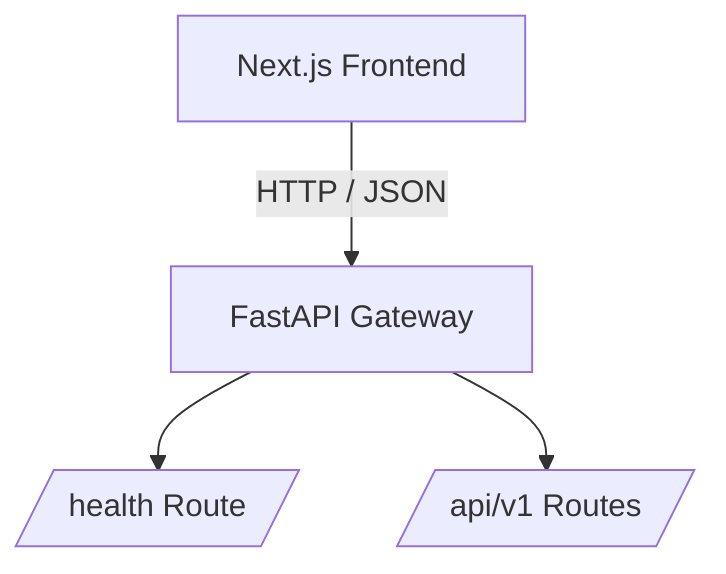

# Core API Service

Production-ready FastAPI backend foundation built for scalability and clean modular extension.

## Architecture



## Quick Start

1. Clone repository & enter directory:
```Bash
git clone https://github.com/SenaEnana/Core-API-Service
cd Core-API-Service
```
2. Create virtual environment & install dependencies:
```Bash
python -m venv .venv
source .venv/bin/activate  # On Windows: .venv\Scripts\activate
pip install -r requirements.txt
```
3. Run the local development server:
```Bash
uvicorn app.main:app --reload
```
4. Access interactive documentation:

* Swagger UI: http://127.0.0.1:8000/docs

* Health check: http://127.0.0.1:8000/health

```bash
check check tmrw